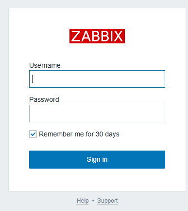
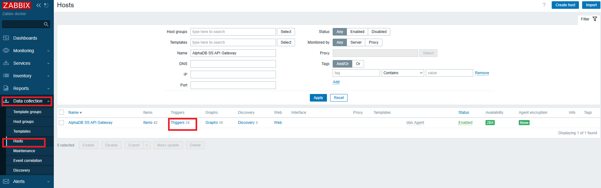
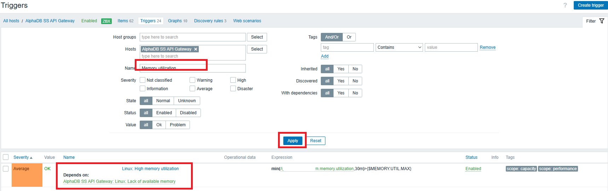
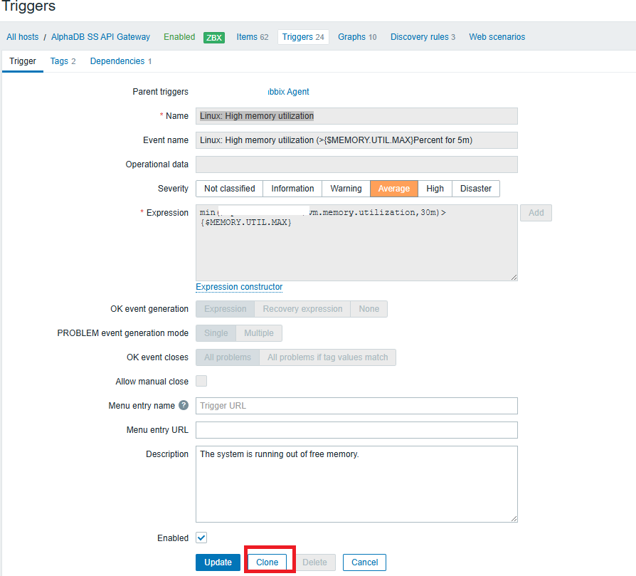
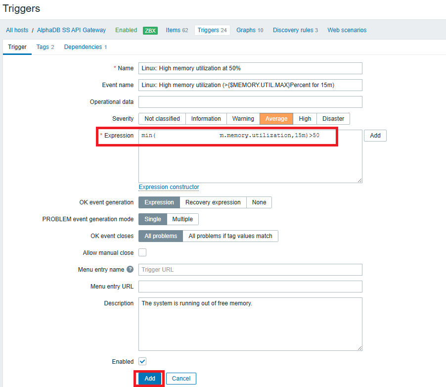

# Adjust Memory Utilization for Zabbix Triggers

## Description

This guide will help you adjust Zabbix triggers to monitor memory utilization thresholds on your servers. You can fine-tune these triggers to generate alerts based on the amount of memory being used, ensuring that you stay informed about potential memory-related issues before they affect your systems.

## Prerequisites

Zabbix Server: A running Zabbix server with agent(s) installed on the systems you want to monitor.

Zabbix Agent: Ensure that Zabbix agents are configured to report memory usage on the monitored systems.

## Steps :-

Log in to the Zabbix Server Web Interface

Navigate to Data Collection
+ In the Zabbix dashboard, go to the "Data collection" section.
+ Click on "Hosts," and then choose the host for which you want to adjust memory triggers.
+ Select "Triggers" for the chosen host.

Search for Memory Utilization
+ In the "Triggers" section, search for "memory utilization."
+ Click the "Apply" button to filter the results.
+ Select the trigger for "High memory utilization."

After selecting the "High memory utilization" trigger, click the "Clone" button to create a copy of the trigger for editing.

Adjust the conditions in the trigger expression as needed to reflect the memory thresholds you want to monitor.

Once you've made the necessary changes, click the "Add" button to save the new trigger.

By following these steps, you will have successfully adjusted the memory utilization trigger in Zabbix, helping you maintain better control over your system’s memory usage and receive alerts when critical thresholds are reached.