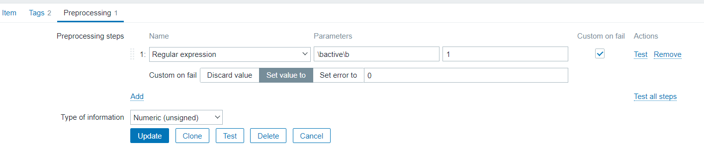

# Monitoring a Linux Service with Zabbix

## Description

This guide will walk you through the steps of monitoring a specific Linux service using Zabbix. By configuring Zabbix to track the status of a service, you can receive notifications when a service goes down, ensuring that critical applications remain operational.

## Prerequisites

Before starting, ensure the following:

+ The Zabbix agent is installed on the target machine.

+ Remote commands are enabled in the Zabbix agent configuration file (zabbix_agentd.conf or zabbix_agent2.conf).

## Steps

### Step 1: Enable Remote Commands on the Zabbix Agent

Log in to the client machine where the service you want to monitor is running.

Open the Zabbix agent configuration file by editing either zabbix_agentd.conf or zabbix_agent2.conf.

Use a text editor (like vim, nano, or vi):

```bash
sudo nano /etc/zabbix/zabbix_agentd.conf
```

Add the following line to the configuration file. This line defines a custom parameter that checks the status of a given service using systemctl:

```bash
UserParameter=service.status[*],systemctl is-active $1
```


This allows Zabbix to monitor the status of any service by passing the service name as an argument.

Set the following options in the configuration file:

+ UnsafeUserParameters=1: This allows Zabbix to execute custom user parameters.
+ EnableRemoteCommands=1: This enables the execution of remote commands.


Restart the Zabbix agent to apply the changes:

```bash
sudo systemctl restart zabbix-agent.service
```

Verify the custom parameter to ensure it's working as expected. Run the following command to test if the agent can successfully check the status of the SSH service:

```bash
zabbix_agentd -t 'service.status[ssh]'
```


If the configuration is correct, this command will return the status of the ssh service (e.g., 1 for active, 0 for inactive).

### Step 2: Create a Template for Monitoring the Service

Log in to the Zabbix Web UI to create a monitoring template.


Navigate to the following path:
+ Dashboard → Data Collection → Templates


Create a new template:
+ Template Name: Service Monitor
+ Template Groups: Service
+ Click the Add button to create the template.


Create a monitoring item for the service:
+ Open the template you just created.
+ Go to the Items tab and click Create Item.


Configure the item:
+ Name: SSH Service Monitor
+ Key: service.status[ssh] (this will monitor the SSH service status)
+ Update Interval: 1m (this means the service status will be checked every minute)

Save the item once you've entered the details.


### Step 3: Pre-process the Service Status Data

Navigate to the Pre-processing section for the item you created.

+ We are going to map the value active=1
+ Choose: Name = Regular expression 
+ Parameters: \bactive\b 
+ output: 1
+ Check box custom on fail , below choose Set value to = 0
+ Type of Information: Numeric(unsigned)



Test the output
+ Now choose Test And Enter the Host (ssh service host), Port.
+ Click Get Value and Test


If the result is 1, the service is active. If so, click Add to save the configuration.

### Step 4: Create a Trigger for Service Downtime

Create a trigger that will notify you when the service goes down:
+ In the Zabbix Web UI, go to Configuration → Triggers and click Create Trigger.

Configure the trigger with the following details:
+ Name: ssh service down
+ Operational Data: {ITEM.LASTVALUE}
+ Severity: Average [ Choose as per your requirement ]
+ Problem expression:  last(/Service Monitor/service.status[ssh],#2)<>1
+ Ok Event generation: Recovery Expression
+ Recovery expression: last(/Service Monitor/service.status[ssh],#2)=1
+ Then Add for Save. 


After completing these steps, your Zabbix setup will actively monitor the status of the SSH service on the Linux machine. You’ll receive alerts if the service goes down, and you'll be able to see its current status directly from the Zabbix dashboard.