# Applying AWS RDS (PostgreSQL) Instance Template in Zabbix

This guide provides step-by-step instructions for applying an AWS RDS PostgreSQL instance template in Zabbix. This setup allows for effective monitoring of your RDS PostgreSQL instances, enabling you to track performance metrics and manage alerts efficiently.

## Prerequisites :-

+ Zabbix Server: A running Zabbix server instance with access to the Zabbix web interface.

+ AWS RDS PostgreSQL Instance: An existing RDS PostgreSQL instance that you want to monitor.

## Steps :- 

### Adding a Template

Access your Zabbix server

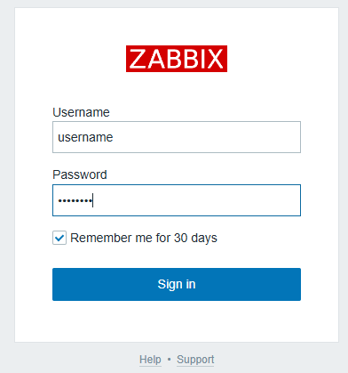

Click on "Data collection" and then select "Hosts".

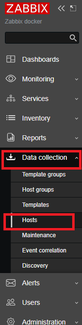

Select the target host you want to monitor.

Click the "Select" button to choose a template.

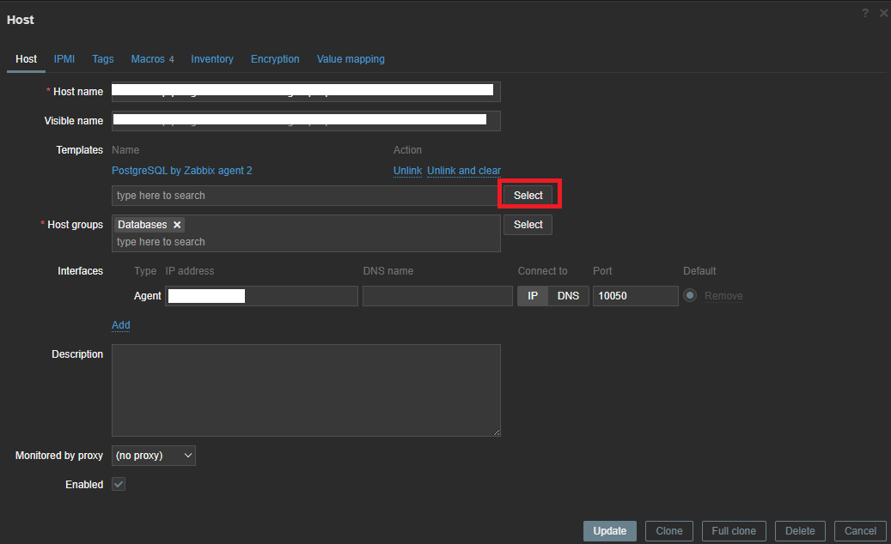

Under the "Templates" group, select "AWS RDS Instance by HTTP" and click the "Select" button.

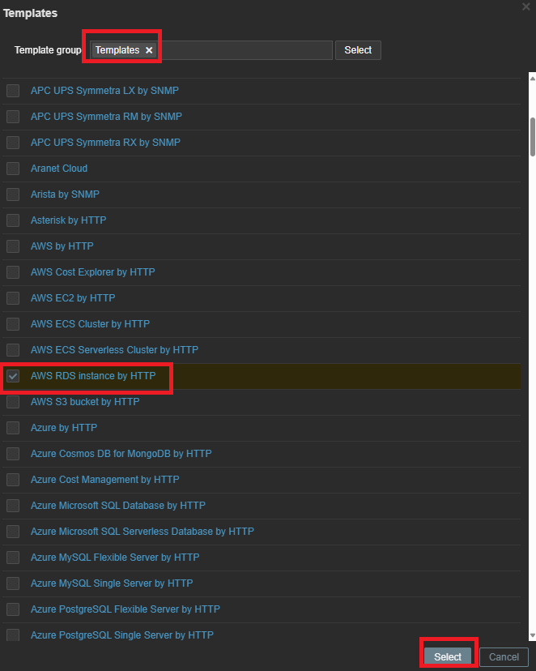

Go to the "Macros" section, then select "Inherited and host macros". Update the following macros as necessary:

+ {$AWS.ACCESS.KEY.ID}
+ {$AWS.REGION}
+ {$AWS.SECRET.ACCESS.KEY}
+ {$AWS.RDS.INSTANCE.ID}

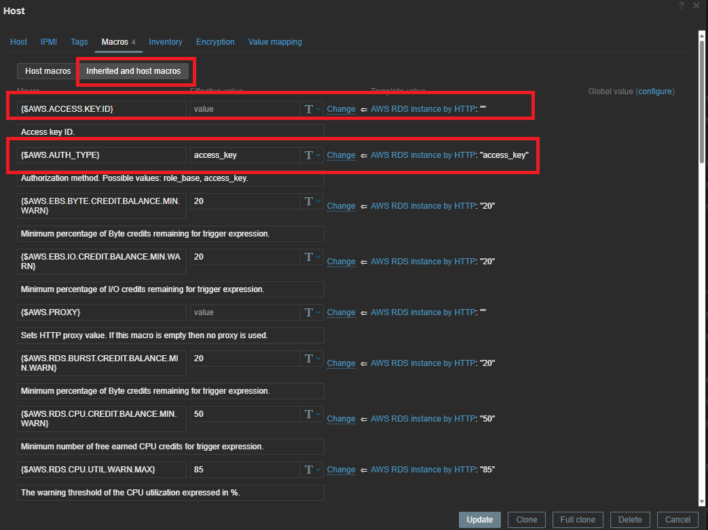

Once you have made the necessary changes, save your updates by clicking the "Update" button.

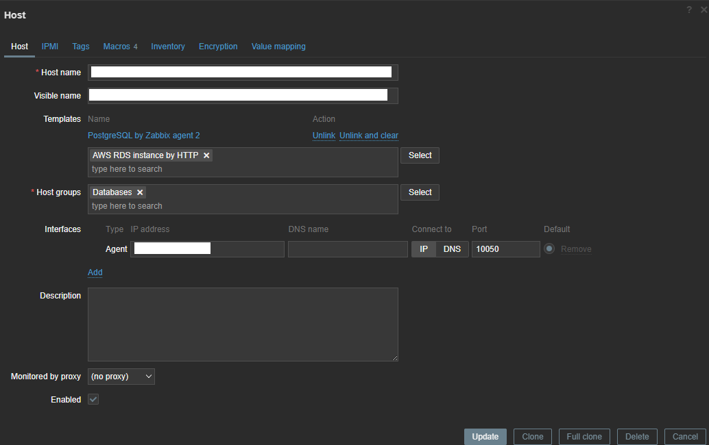

### Adding a Dashboard Widget

Click on the Zabbix logo to return to the main dashboard, then select "Edit Dashboard".

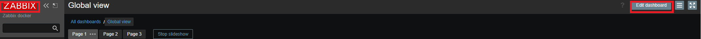

Click the "+ Add" button and configure the widget settings as shown in the following images/image.

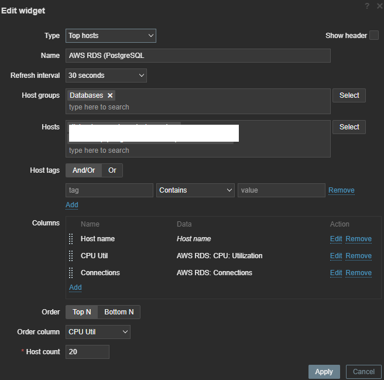

Configure the columns according to your requirements.

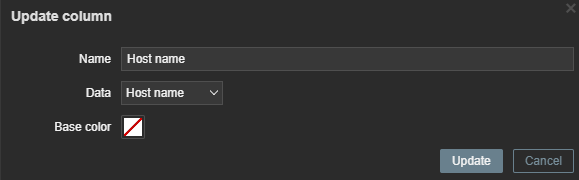

Set up the CPU utilization widget as needed.

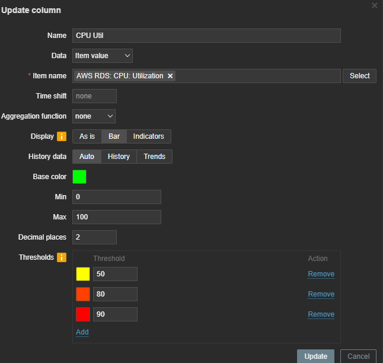

Lastly, configure the connections widget.

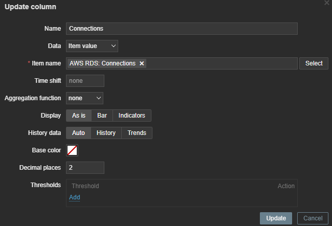

Once everything is configured, click "Apply" to finalize your dashboard setup.
