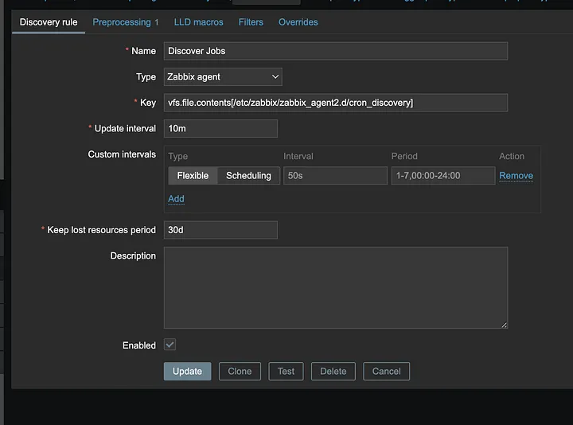
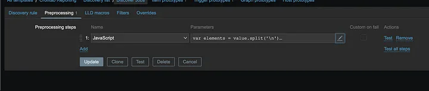
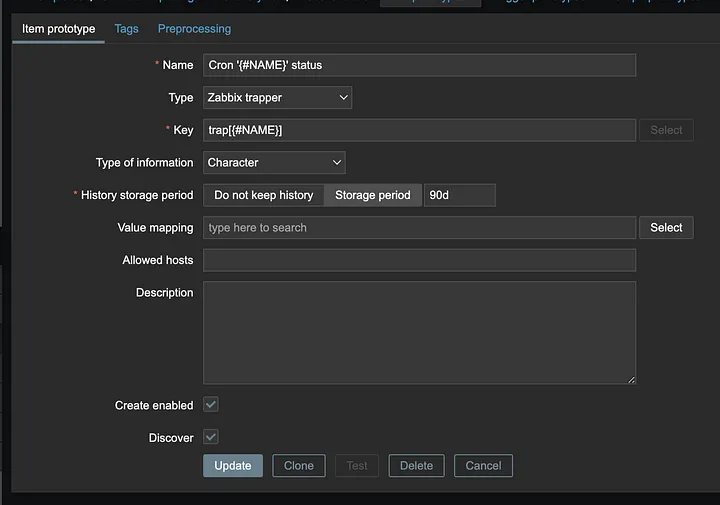
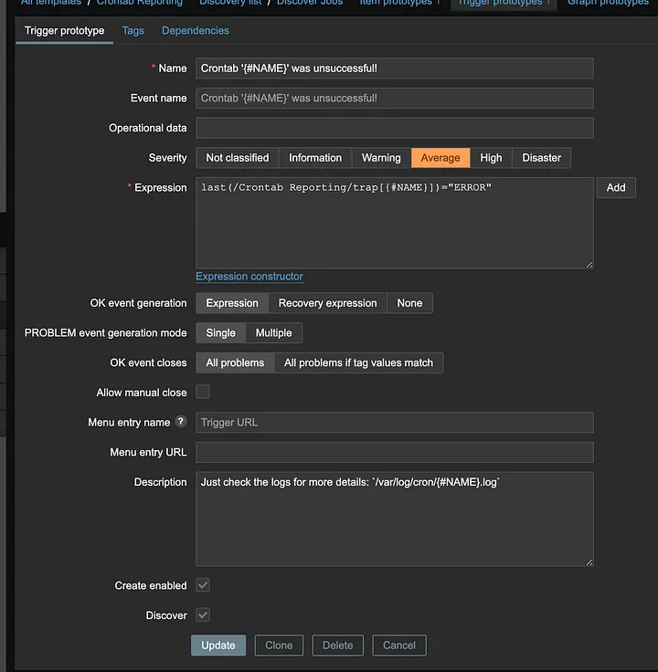

# Zabbix Crontab Monitoring

## Overview

This guide explains how to monitor crontab tasks in Zabbix by using trapper items, triggers, and a custom wrapper script. Key highlights include:

- `Trapper Items and Triggers`: Each crontab entry corresponds to a Zabbix trapper item and trigger. The item will have a status of `OK` or `ERROR`. The trigger is activated if the status is `ERROR`.
- `Wrapper Script`: A script is created to execute the actual cron task and send the status (`OK` or `ERROR`) to Zabbix based on the task's exit code (0 for success, any other code for failure).
- `Crontab Integration`: The wrapper script is added to the crontab for execution.
- `Additional Benefits`: Includes features such as individual log files for each crontab task and automatic log rotation.

## Dependencies

Install these tools on Debian-based operating systems using:

```bash
apt install moreutils
apt install zabbix-sender
```

## Steps

### Create Zabbix Items and Triggers for Crontab Entries

Add a Discovery File: Create a file at `/etc/zabbix/zabbix_agent2.d/cron_discovery`. Each line corresponds to a crontab entry, a Zabbix item, and a trigger. Example content:

```bash
restic-cache-clear
restic-forget
paperless-backup
firefly-backup
```

Configure a Zabbix Template:

- Create a template named "Crontab Reporting".
- Add a discovery rule with the key: vfs.file.contents[/etc/zabbix/zabbix_agent2.d/cron_discovery].



Add JavaScript Preprocessing: 



Use the following script for preprocessing:

```bash
var elements = value.split('\n')

var list = [];

for (var i = 0; i < elements.length; i++) {
  list.push({"{#NAME}": elements[i]})
}

return JSON.stringify(list);
```

Define Item and Trigger Prototypes:
- Item Prototype: Create a Zabbix item to monitor each crontab entry.



- Trigger Prototype: Define a trigger with the expression:
last(/Crontab Reporting/trap[{#NAME}])="ERROR" 



Run the Discovery Rule: Assign the template to a host and run the discovery rule.

### Send ERROR or OK Status from Crontab to Zabbix

Create the Wrapper Script: Save the following script as `/usr/local/bin/zabbix_cron_executor`:

```bash
#!/bin/sh
  
# variables
IDENTIFIER=$1
COMMAND="$2"

# execute command and get result
bash -l -c "$COMMAND"
RESULT=$?

# parse status
if [ $RESULT -eq 0 ]; then
  STATUS=OK
else
  STATUS=ERROR
fi

# send status to zabbix
echo "Sending status $STATUS to zabbix!"
zabbix_sender -z <Zabbix-Serverhost> -s <Localhost-Name> -k trap[$IDENTIFIER] -o $STATUS >> /dev/null
```

Replace <Zabbix-Serverhost> and <Localhost-Name> with the appropriate values (e.g., zabbix.example.com and test-server-1).

Create a Logging Script: Save the following script as `/usr/local/bin/zabbix_cron`:

```bash
#!/bin/sh

# prepare log folder
mkdir -p /var/log/cron

# variables
IDENTIFIER=$1
LOGFILE="/var/log/cron/$IDENTIFIER.log"
COMMAND="$2"


# Execute command and send result to zabbix
zabbix_cron_executor $1 "$2" 2>&1 | ts "[%Y-%m-%d %H:%M:%S]" >> $LOGFILE


# Autotruncate Logfile
REWRITE_AT_LINES=2000
TRUNCATE_TO_LINES=1000

if [ $(wc -l < $LOGFILE) -ge $REWRITE_AT_LINES ];
then
  echo 'Do truncate...' | ts "[%Y-%m-%d %H:%M:%S]" >> $LOGFILE
  tail -$TRUNCATE_TO_LINES $LOGFILE > $LOGFILE.1
  mv $LOGFILE.1 $LOGFILE
fi
```

`Set Permissions`: Make the scripts executable and create the log directory:

```bash
chmod 777 /usr/local/bin/zabbix_cron
chmod 777 /usr/local/bin/zabbix_cron_executor
chmod 777 /var/log/cron/
```

### Add the Wrapper Script to Crontab

For each cron task, call the wrapper script like this:

```bash
0 8–20/2 * * * zabbix_cron paperless-backup "python3 /root/scripts/backupPaperless.py"
```

+ paperless-backup is the unique identifier for this task and should match an entry in the discovery file.

+ python3 /root/scripts/backupPaperless.py is the actual script to be executed.

## Key Benefits
+ Dedicated Logs: Each crontab task has a separate log file at /var/log/cron/<IDENTIFIER>.log.
+ Timestamped Logs: Every log entry includes a timestamp (e.g., [2023-05-01 00:01:06] Performing backup…).
+ Automatic Log Rotation: Logs exceeding 2,000 lines are truncated to the last 1,000 lines, maintaining efficiency.