# Integrating Zabbix with Microsoft Teams

This guide outlines the steps to set up an integration between Zabbix and Microsoft Teams for effective notification management. The integration allows alerts from Zabbix to be sent directly to a specified Teams channel.

## Configuration Steps

### 1. Microsoft Teams Setup

Step 1: Create a Channel in Microsoft Teams

Open Microsoft Teams and navigate to the desired team where you want to create a channel.

Click on "Add Channel".

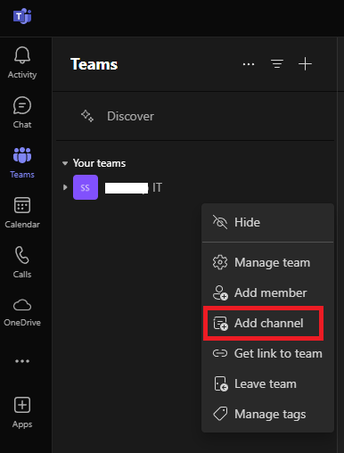

Enter the channel name and select the desired channel type (Standard or Private). Then click on the "Create" button.

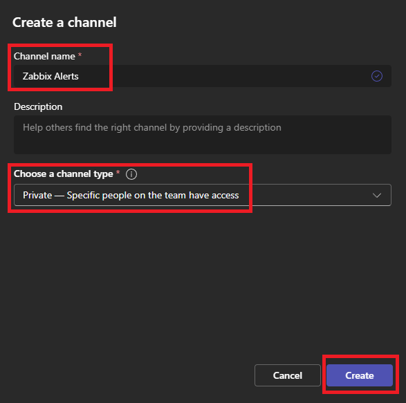

Step 2: Add Members to the Channel

Choose to add members to the channel or click the "Skip" button to proceed without adding members.

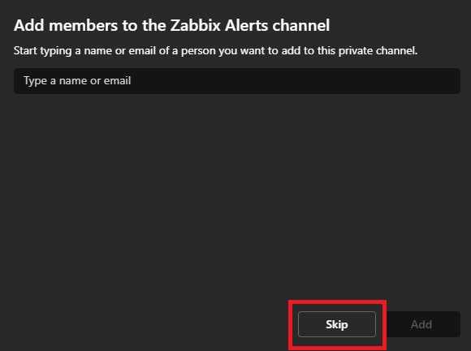

Step 3: Manage Channel Settings

After creating the channel, click on "Manage Channel" to access its configuration.

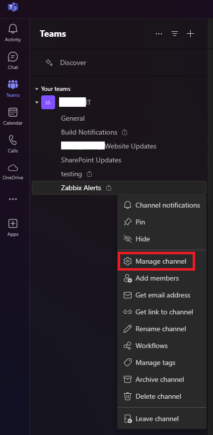

Step 4: Configure the Webhook

In the channel settings, click on "Settings", and under the "Connectors" section, click the "Edit" button.

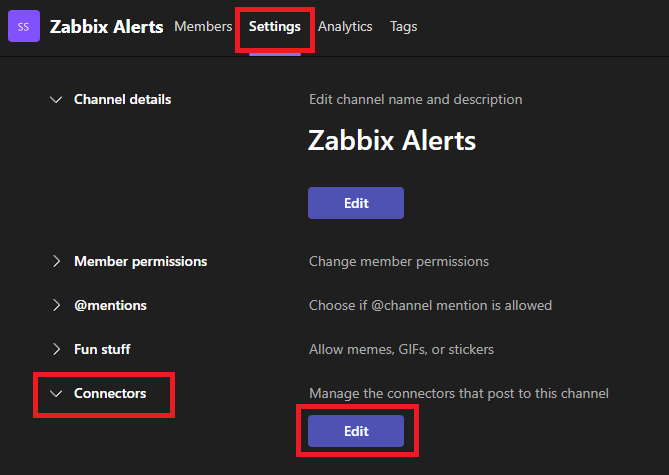

Select "Configure" to set up the webhook.

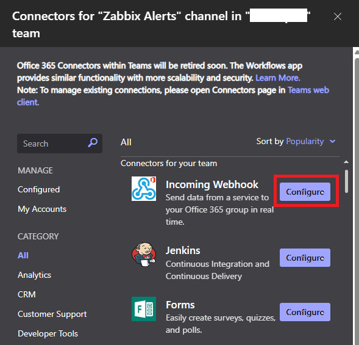

Step 5: Complete Webhook Setup

Provide a name for the Zabbix notifications (e.g., "Zabbix Alerts"). Optionally, upload an images/image to represent the webhook.

Click the "Create" button to finalize.

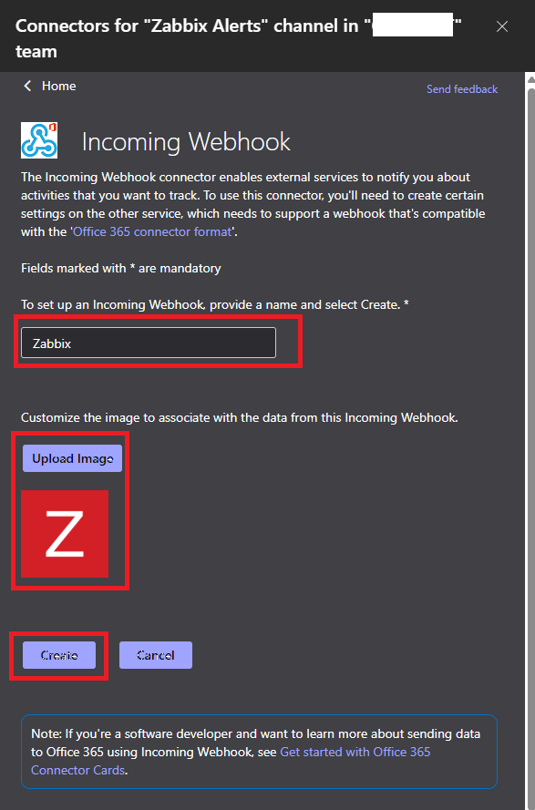

Copy the generated webhook URL and click "Done" to complete the configuration.

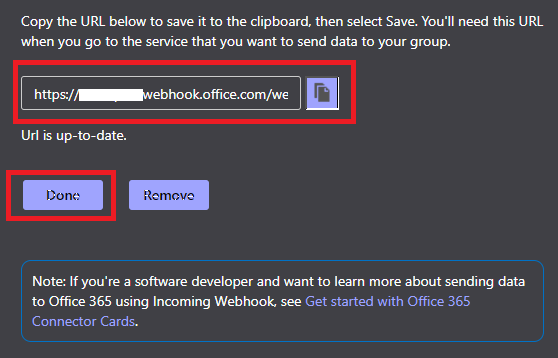

### 2. Zabbix Notification Setup

Step 1: Access the Zabbix Web Interface

Log in to your Zabbix web UI.

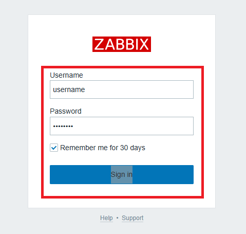

Step 2: Configure Media Types

Navigate to "Alerts", then select "Media types".

Locate and select the "MS Teams" media type.

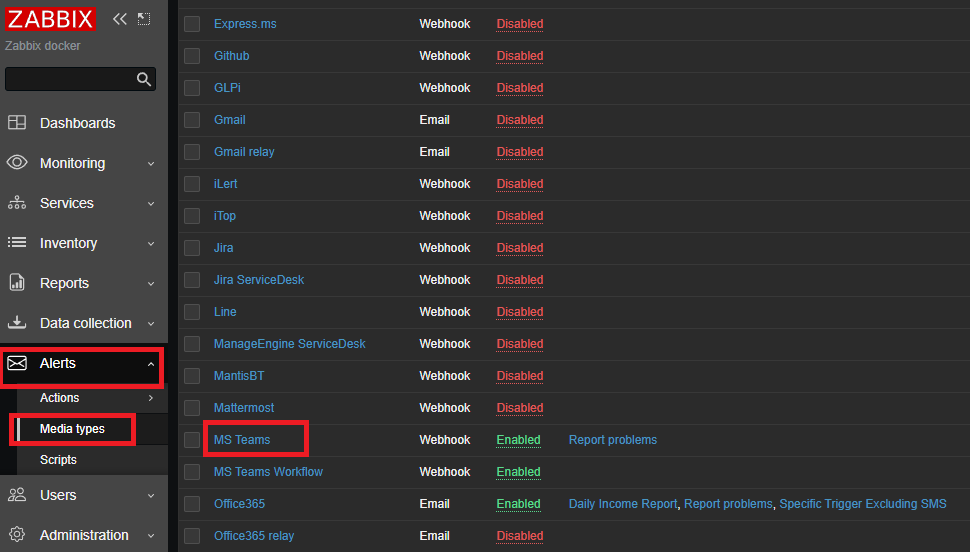

Replace the existing value of "teams_endpoint" with the webhook URL copied from Teams.

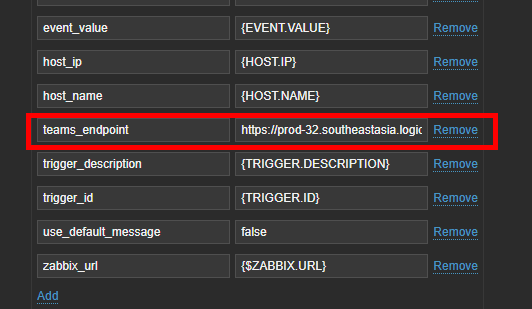

Click the "Update" button to save the changes.

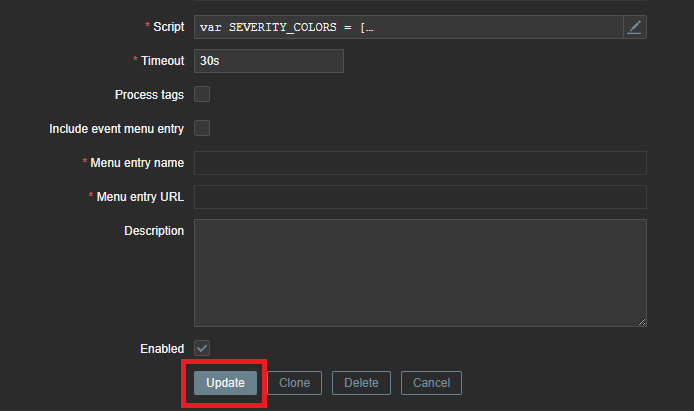

Step 3: Set Up Trigger Actions

Go to "Alerts", then select "Actions", and click on "Trigger Actions".

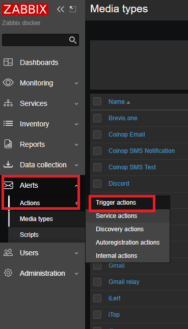

Choose the desired trigger name that corresponds to the alert you want to send to Teams.

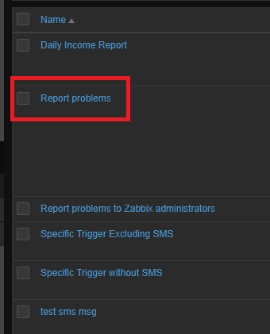

Open the "Operations" tab and click "Add".

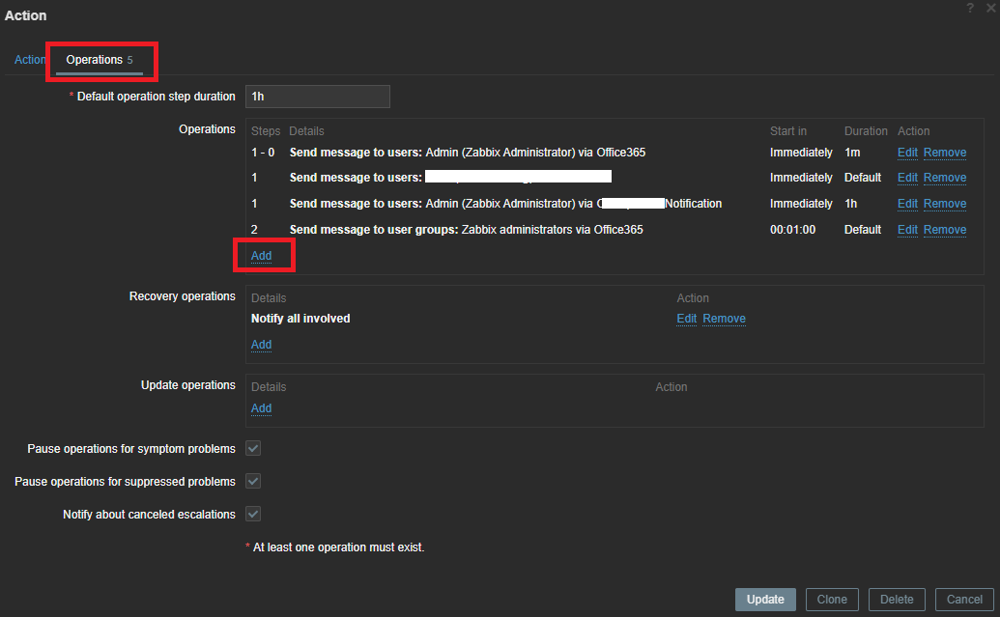

Input the operation details as shown in the example below, then click "Update".

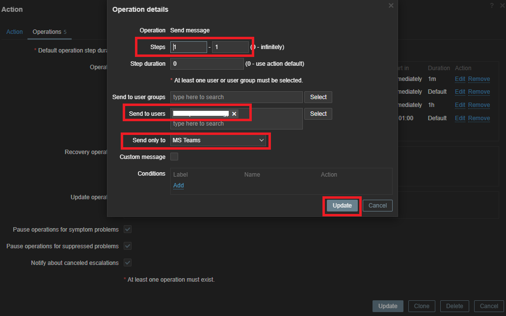

Step 4: Finalize and Test

Click the "Update" button again to apply all changes to the trigger action.

Ensure that users have the appropriate media (MS Teams) configured in their profiles, then click "Update".

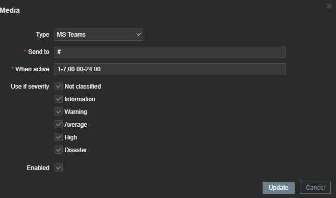