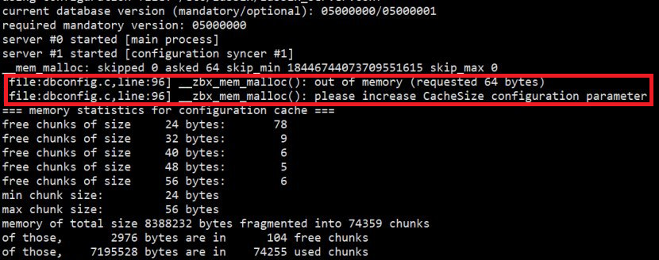
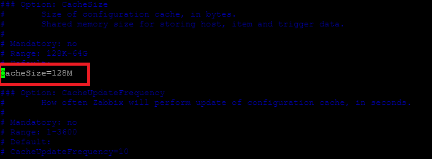

# Zabbix: Resolving Out of Memory Issue




## Steps:-

Follow the steps below to address the "Out of Memory" issue in your Zabbix server.

### Access the Zabbix Server

First, log in to the Zabbix server where the issue is occurring.

### Identify the Running Zabbix Container

To check the currently running Zabbix container, execute the following command:

```bash
docker ps
```

This will display a list of active containers along with their container IDs.

### Copy the Configuration File

Once you have identified the container ID, copy the Zabbix server configuration file from the running container to your local directory using the following command:

```bash
docker cp <CONTAINER_IP>:/etc/zabbix/zabbix_server.conf .
```

for example:

```bash
docker cp 9b697598a108:/etc/zabbix/zabbix_server.conf .
```

### Update the Configuration File

Open the `zabbix_server.conf` file using a text editor and modify the `CacheSize` parameter to allocate more memory as needed.

Example configuration update:



After making the necessary changes, save the file and exit the editor.

### Stop and Remove the Existing Zabbix Container

Before applying the updated configuration, stop and remove the current Zabbix container by running:

```bash
docker stop 9b697598a108
docker remove 9b697598a108
```

### Restart the Zabbix Container with Updated Settings

Now, start a new Zabbix container with the updated configuration file using the command below:

```bash
docker run --name zabbix-server-mysql \
-t -e DB_SERVER_HOST="<DB_SERVER_HOST>" \
-e MYSQL_DATABASE="zabbix" \
-e MYSQL_USER="zabbix" \
-e MYSQL_PASSWORD="<MYSQL_PASSWORD>" \
-e MYSQL_ROOT_PASSWORD="<MYSQL_ROOT_PASSWORD>" \
-e ZBX_JAVAGATEWAY="zabbix-java-gateway" \
--network=zabbix-net \
-p 10051:10051 \
--restart unless-stopped \
-d -v /home/ubuntu/zabbix_server.conf:/etc/zabbix/zabbix_server.conf \
zabbix/zabbix-server-mysql:alpine-6.4-latest
```

By following these steps, your Zabbix server should now be running with an increased cache size, which can help prevent memory-related issues.
