# Zabbix Weekly Report

This procedure outlines the steps to configure Zabbix for weekly server uptime monitoring and automated alerts for server restarts. By following this guide, administrators can ensure proactive monitoring and timely notifications regarding system restarts across multiple servers.

## Objective 

The goal of this setup is to detect server restarts within a week, monitor uptime across multiple servers, and send automated alerts via SMS when necessary.

## Setup

### Step 1: Create a Trigger for Each Target Server

Navigate to Data Collection > Hosts.

Select the target host and go to the Triggers tab.

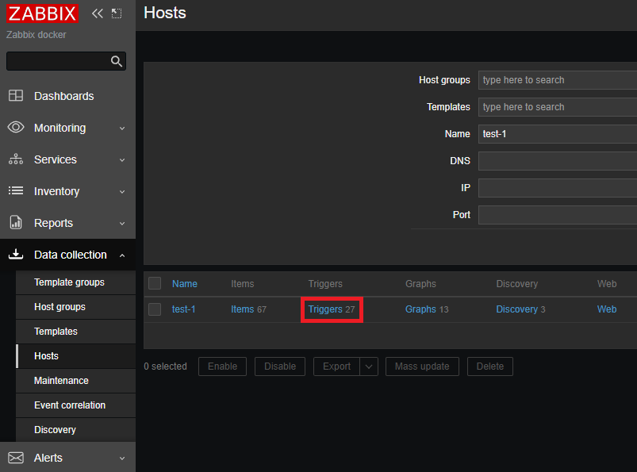

Find and select the trigger named "Linux: {HOST.NAME} is down".

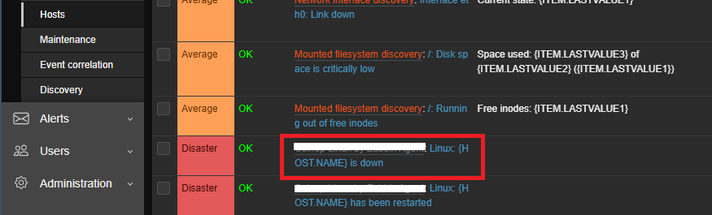

Click the Clone button to duplicate the trigger.

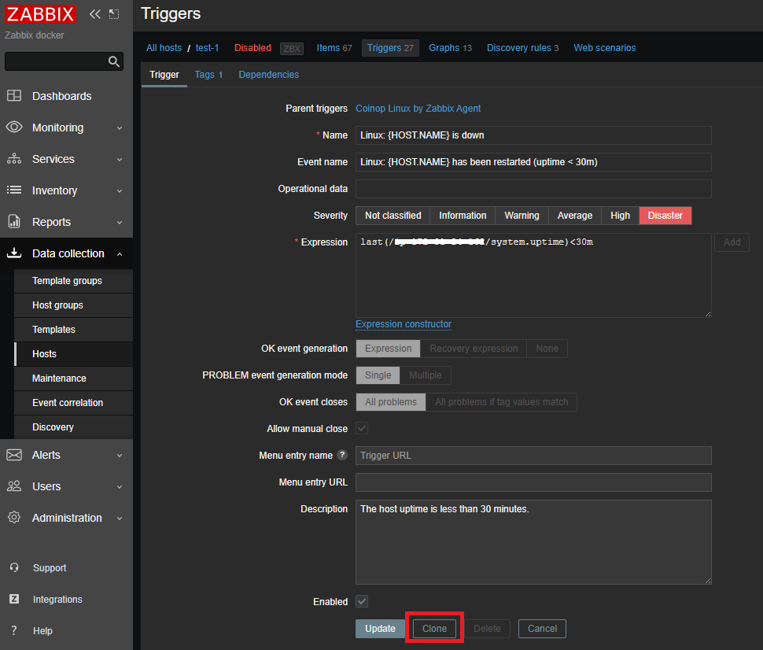

Modify the following fields:

+ Name: Change to "{HOST.NAME} Server restarted within a week".
+ Event Name: Update to "{HOST.NAME} Server restarted within a week".
+ Expression: Replace it with the following formula:

```bash
last(/<HOSTNAME>/system.uptime) < 604800
```

Click the Add button to save the trigger.

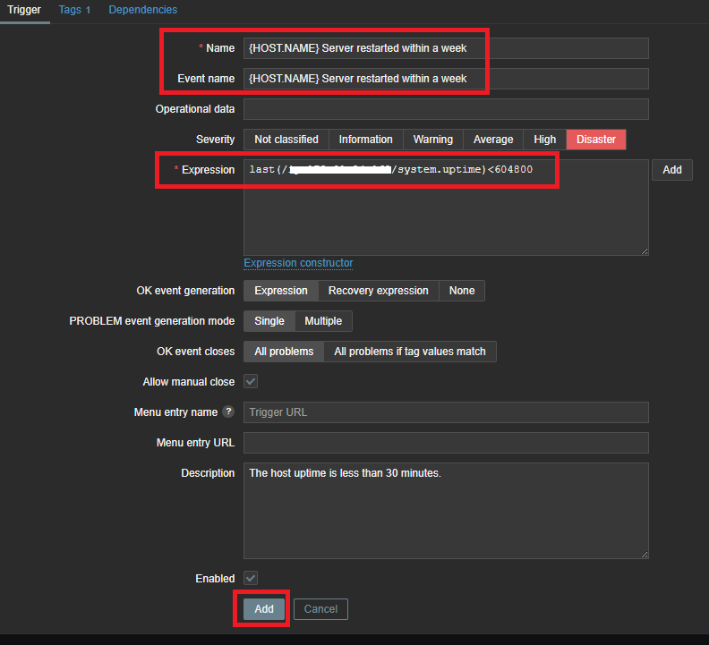

### Step 2: Create a New Host for Server Monitoring

Navigate to Data Collection > Hosts and click Create Host.

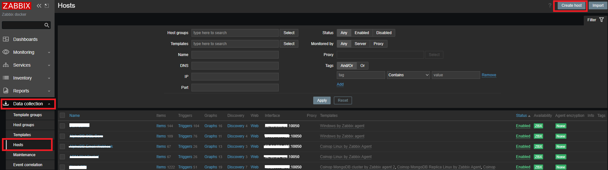

Set the following parameters:

+ Host Name: Enter "Server Monitor Group".
+ Host Group: Select an appropriate group.
+ Click the Add button.

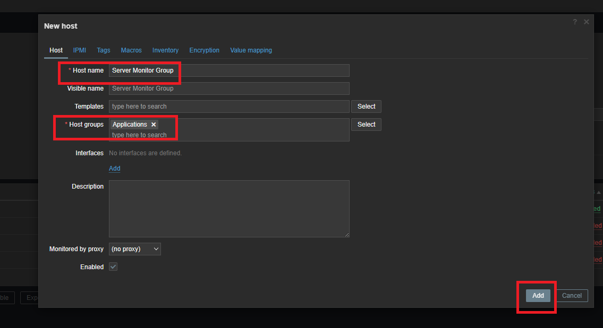

### Step 3: Create a Monitoring Item

Select the newly created "Server Monitor Group" host and go to the Items tab.

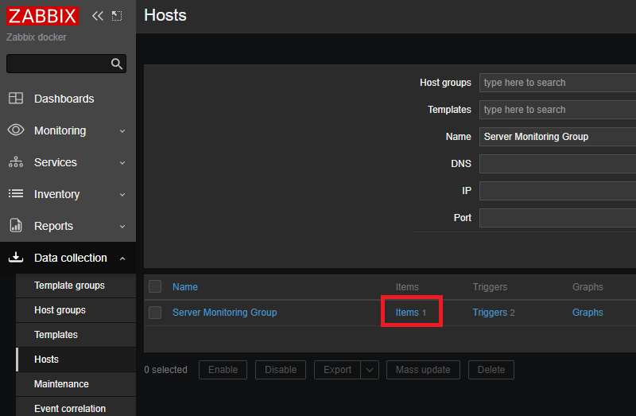

Click Create Item on the right side of the screen.

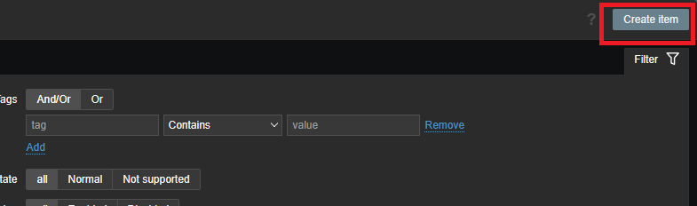

Configure the item with the following settings:

+ Item Name: Enter a descriptive name.
+ Type: Select Calculated.
+ Key: Enter uptime_check.all_servers.
+ Formula: Define a formula based on the number of servers to be monitored. (Example: Assume monitoring 3 servers.)
+ Update Interval: Set to 1 minute (1m).

Click Add or Update to save.

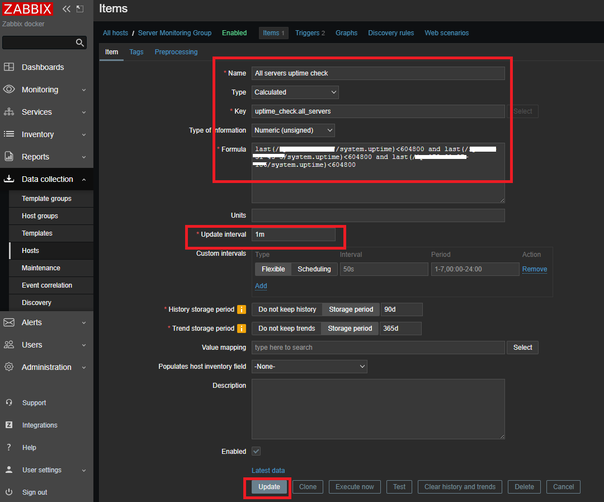

### Step 4: Create Triggers for Monitoring

Navigate to the Triggers tab.

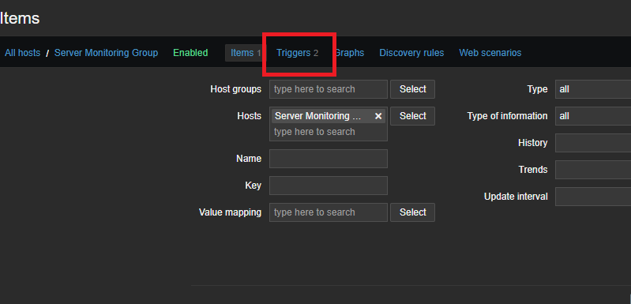

Click Create Trigger.

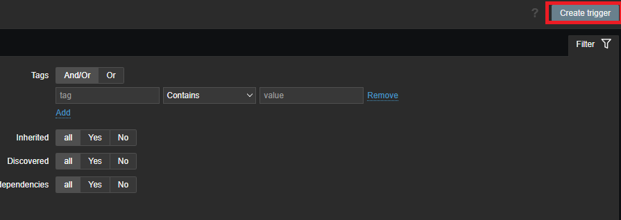

Set up the following details:

+ Trigger Name: Enter a descriptive name.
+ Severity: Select Disaster.
+ Expression: Define the logic to detect if no servers have restarted.

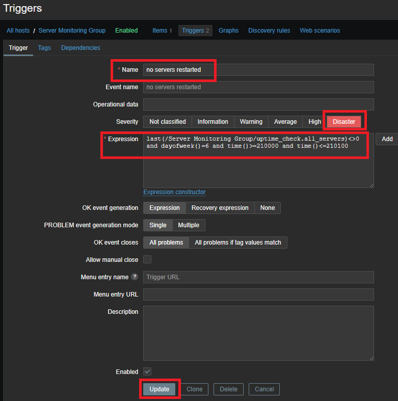

Click Add or Update.


Create another trigger with the same process, ensuring that the Severity is still set to Disaster, and update the Expression accordingly.

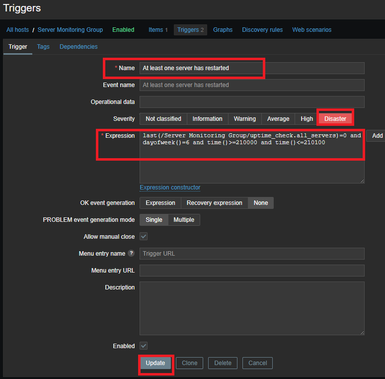

### Step 5: Configure Alert Actions

Navigate to Alerts > Actions and click Trigger Actions.

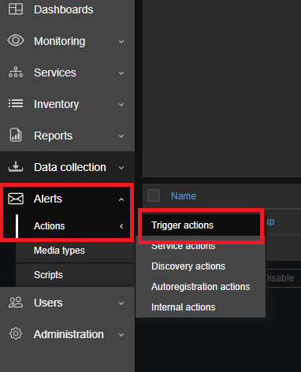

Click Create Action and set up the following:

+ Action Name: "Weekly Server Restart Alert".
+ Conditions: Click Add, then set:
+ Type: Trigger
+ Operator: Equals
+ Trigger: Select "At least one server has restarted"
+ Click Add to confirm.

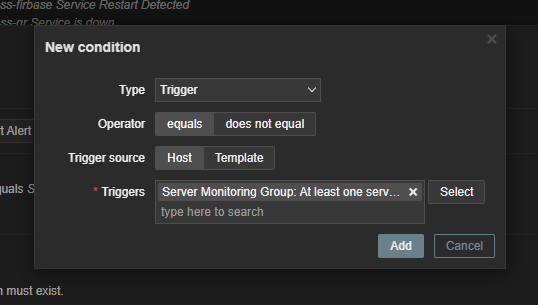

Switch to the Operations tab and click Add.

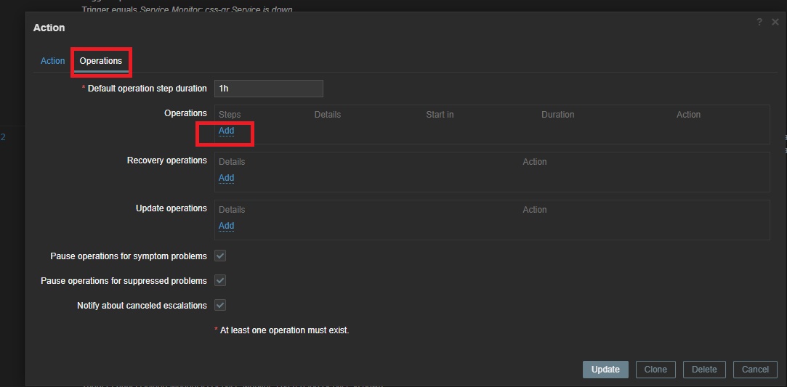

Configure the notification settings:

+ Target User: Select the user who will receive the alert.
+ Send Only To: Choose "SMS Notification for Weekly Report".
+ Custom Message: Enable this option and provide a Subject and Message.
+ Click Add to save.

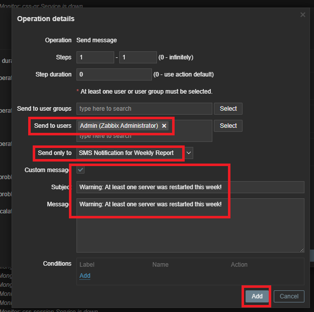

Create another action following the same steps, but with the following differences:

+ Action Name: "Weekly Server Uptime Notification".
+ Condition: Set it to detect when no servers have restarted.
